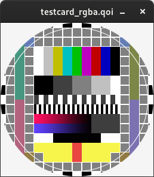

# qoi-viewer

QOI Image viewer using qoi default implementation and Raylib.



## How to:

Requires CMake.

```console
git clone https://github.com/FInISHED-wORK/qoi-viewer.git
cd qoi-viewer
cmake .
make
./qoiviewer <input>.qoi
```

## Copyright:

- Images: Takens from QOI format [website](https://qoiformat.org/)
- [Raylib](https://github.com/raysan5/raylib)
- [qoi.h](https://github.com/phoboslab/qoi) the reference encoder and decoder written by the author of QOI.
